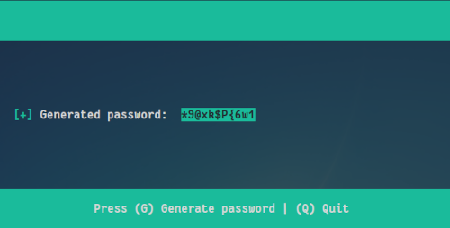
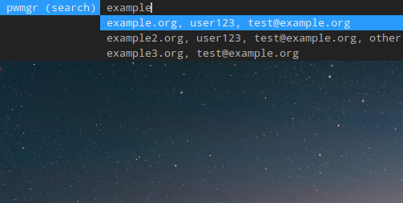

## Password Manager

Commandline password manager coded from scratch in python
<br />



<br />



<br />

### Current Features:
- Generates secure password & stores user information in encrypted containers
- Encrypts & decrypts database completely in memory
- Uses AES 256 bit encryption, therefore doesn't require managing gpg keys 
  & doesn't doesn't leak meta data information
- Helpful commandline interface, similar to pass (unix password manager)
- Can migrate existing password database from pass
- Can add, search, edit, remove information & copy password to clipboard
- Pop up search bar with autocomplete feature for passwords *[Added: 12/01/2021]*
- Import from / Export to csv file option has been enabled *[Added: 14/01/2021]*

<br />

### Improvements / Bug fixes:
- Dmenu binding to search & display record (--show-dmenu)
- Integrity checking of database
- Updated format, now there's no limit on database size
- Fixed some minor bugs

<br />

### Requirements:
- Python 3.x
- Python modules: colorama, keyring, pyperclip, platform, getpass, fernet, csv, cursor
- Requires dmenu package in Linux if you want to use the search bar
- Linux / Unix operating system (recommended)

<br />

### Installation:

Installing required Python modules: 

```
pip3 install --user colorama, keyring, pyperclip, platform, getpass, fernet, csv, cursor
```


Installing pwmgr on your Linux system: 

```
git clone "https://github.com/zah20/pwmgr" && cd pwmgr && chmod +x pwmgr.py && sudo cp -rvf *.py /usr/bin/;
```

<br />

#### Optional - Search bar (dmenu)

Gentoo Linux

```
emerge -av 'x11-misc/dmenu'
```


Ubuntu
```
apt-get install -y dmenu
```


<br />

The search bar can be binded to keys, for example if you're using i3 window manager on Linux 
you can add the following command to your startup config to have the search bar run automatically: 

```
# Adding record (replace terminology with any other terminal)
bindsym $mod+a exec --no-startup-id terminology -e /usr/bin/pwmgr.py -a

# Search with dmenu & show record 
bindsym $mod+o exec --no-startup-id terminology -e /usr/bin/pwmgr.py -O 

# Search with dmenu & copy password to clipboard
bindsym $mod+c exec --no-startup-id /usr/bin/pwmgr.py -C 

```

<br />

### Basic Usage

```

    pwmgr [add, -a]

          Allows the user to add a new record to the database


    pwmgr [edit, -e] [record number]

          Allows the user to edit the specified entry in the database


    pwmgr [search, -s] [group | site | email | username | all] keyword

          Search by group, site, ..., etc. 

          All records that match the specified keyword will be shown 

          * By default the search keyword without any other additional
            parameters uses the 'search all' function
            e.g: 'pwmgr search some_keyword'
          
          group     - Search for the keyword by group 
          site      - Search for the keyword by website 
          email     - Search for the keyword by email address
          username  - Search for the keyword by username
          all       - Search for the keyword in group, site, 
                      email & username


    pwmgr [show, -o] [record number]

          Show details about the specific record from the database

          * By defaut show command without a record number, 
            displays a brief summary of the entire database
            e.g: 'pwmgr show'

          * Multiple comma separated values can also be passed 
            to the show command & it will display detailed
            information about those records. 
            e.g: 'pwmgr show '1,2,3'


    pwmgr [show-dmenu, -O] 
        
          Search & display record using dmenu bar 


    pwmgr sort recent
    
          Show all entries from database sorted by most recently updated

          * Can be useful to check which entries got updated & when


    pwmgr [copy, -c] [record number]

          Copies the password for the specific entry to the clipboard
    

    pwmgr [copy-dmenu, -C] 
        
          Searches for record using dmenu bar & copies the password 
          to clipboard for selected record.
          
          * Dmenu has autocompletion features built-in, so this feature 
            is a bit more convenient to use.


    pwmgr [rm, -d] [record number]

          Remove the specified entry from the database

          * This command also accepts comma separated values & 
            can remove multiple entries. e.g: 'pwmgr rm 2,3,4'


    pwmgr [generate, -g]

          Allows the user access to the password generator


    pwmgr key [show | reset]

          show  - Displays the current key that is being used
                  for encryption

          reset - Allows the user to change the master key
                  The user will be prompted for the old password
    

    pwmgr keyring reset

          Allows the user to remove password from keyring

          * This command can be useful for example if you have 
            a different password database & you want to remove
            the previous password that was set on the keyring
        

    pwmgr import pass
         
          Scans for Pass (Unix Password Manager) password store
          & imports all relevant information if they exist

          * This feature is experimental & has not been thoroughly
            tested yet. Although there are no observable bugs
            but if you do encounter one, please report to my email


    pwmgr import csv [filename]

          Imports database from csv file. Two data formats are currently supported

          1) site,password,username

          2) site,pass,last_modified,email,..,phone_number 
             (10 fields, that are used internally by pwmgr)

          When importing from csv, all fields other than header 
          must be enclosed in double quotes
          

    pwmgr export csv [filename]

          Exports all fields in the database to csv format


    pwmgr export csv-brief [filename]

          Exports only 'site,password,username' fields to csv format


    pwmgr [help, -h]

          Show this text


```

<br />

For feedback & related queries please contact: **zhossain@protonmail.com**
<br />


